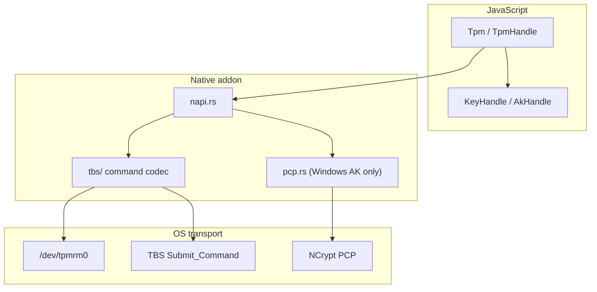

# node-tpm2 API Reference

Complete reference for the public JavaScript API of **node-tpm2** — native TPM 2.0 bindings for Node.js. The library talks to the TPM through OS-native transports (TBS on Windows, `/dev/tpmrm0` on Linux) and returns Buffers and typed records, not CLI text.

**Import:**

```javascript
import { Tpm, TpmError } from 'node-tpm2';
```

**Related docs:** [Getting started](./getting-started.md) · [Windows PCP / fleet enrollment](./windows-pcp.md) · [Roadmap](./roadmap.md)

---

## Table of contents

1. [Architecture](#architecture)
2. [Package structure](#package-structure)
3. [Connection lifecycle](#connection-lifecycle)
4. [Namespace vs flat API](#namespace-vs-flat-api)
5. [Types and wire formats](#types-and-wire-formats)
6. [Root API (`Tpm`)](#root-api-tpm)
7. [Handle API (`TpmHandle`)](#handle-api-tpmhandle)
8. [Key handles (`KeyHandle`)](#key-handles-keyhandle)
9. [Attestation handles (`AkHandle`)](#attestation-handles-akhandle)
10. [Attestation flows](#attestation-flows)
11. [Error model (`TpmError`)](#error-model-tpmerror)
12. [Platform differences](#platform-differences)
13. [Privilege matrix](#privilege-matrix)
14. [Deferred / not in public API](#deferred--not-in-public-api)
15. [Symbol index](#symbol-index)

---

## Architecture

node-tpm2 is a three-layer stack: JavaScript API (`api.js`) → N-API native addon (`native.cjs`, Rust `src/napi.rs`) → TPM transport (`src/tbs/`).



**Design rules:**

- **General keys, PCR, random, ReadPublic, NV, seal** use the shared TBS command path on both Linux and Windows so blobs and behavior stay aligned.
- **Attestation key persistence on Windows** uses NCrypt Platform Crypto Provider (PCP) because raw TBS cannot persist cross-user identity keys reliably.
- **Transient TPM handles** are created and flushed inside each native call. You do not manage TPM handle slots in JavaScript.

---

## Package structure

For npm consumers:

| Artifact | Role |
|----------|------|
| `node-tpm2` (this package) | Pure JS entry: `index.js`, `api.js`, `index.d.ts` |
| `native.cjs` | N-API addon loaded at runtime (may be missing until build/install) |
| `native.d.ts` | Auto-generated types for native bindings (internal; not re-exported) |
| `node-tpm2-<platform>-<arch>-<libc>` | Optional dependency with prebuilt `.node` binary |

Install resolves the correct platform package automatically. Node **20+** required. macOS installs succeed but `Tpm.isAvailable()` returns `false` — there is no Apple TPM backend.

You only import from `'node-tpm2'`. Do not import `native.cjs` directly.

---

## Connection lifecycle

### Probe without opening

```javascript
if (!(await Tpm.isAvailable())) {
  // No TPM, no native binary, macOS, or permission denied at probe time
}
```

`isAvailable()` never throws. It returns `false` if the native module is missing, the platform is unsupported, or the TPM is unreachable.

### Open a session handle

```javascript
await using tpm = await Tpm.open();
// ... use tpm.pcr, tpm.keys, tpm.attest, etc.
// Symbol.asyncDispose runs at block exit (Node 20+ explicit resource management)
```

**What `Tpm.open()` does:**

1. Verifies the native backend loaded (`requireNative('isAvailable')`).
2. Calls `isAvailable()`; if false, throws `TpmError` with code `TPM_UNAVAILABLE`.
3. Returns a **stateless** `TpmHandle` object — a namespace grouping API, not an open file descriptor.

**Disposal:** `[Symbol.asyncDispose]()` on `TpmHandle` is currently a no-op. Each operation opens a TBS context (or PCP session), performs work, and flushes transient TPM objects internally. Future versions may reuse a per-handle TBS context; disposal would then release it.

### Info without opening

```javascript
const info = await Tpm.getFixedProperties();
// or
const info = await Tpm.info(); // alias
```

These call `TPM2_GetCapability` for fixed TPM properties and do not require `Tpm.open()`.

---

## Namespace vs flat API

Every implemented operation exists in two forms:

| Style | Example | When to use |
|-------|---------|-------------|
| **Namespace (preferred)** | `await using tpm = await Tpm.open(); await tpm.pcr.read([0])` | New code; groups related operations; returns rich handles for keys/AK |
| **Flat (legacy-compatible)** | `await Tpm.pcrRead([0])` | Scripts, one-shot calls, README examples |

Flat methods on `Tpm` call the same native functions as the namespace methods. Differences:

- `Tpm.provisionAk()` returns `{ akPublicDer, akBlob }` — not an `AkHandle`.
- `Tpm.createKey()` returns `{ publicKeyDer, keyBlob }` — not a `KeyHandle`.
- `tpm.keys.create()` / `tpm.attest.provisionAk()` return handles with methods (`sign`, `quote`, `export`, …).

See [Namespace comparison table](#namespace-comparison-table).

---

## Types and wire formats

### `AkBlob` / `KeyBlob`

```typescript
type AkBlob = { public: Buffer; private: Buffer };
type KeyBlob = AkBlob; // same wire shape; distinct type name for clarity
```

| Field | Contents |
|-------|----------|
| `public` | **TPM2B_PUBLIC** wire bytes (size prefix + `TPMT_PUBLIC` structure) |
| `private` | **TPM2B_PRIVATE** wire bytes (encrypted sensitive area) |

These are **exportable wrapped key blobs**, not persistent TPM handles. Persist them in your app (encrypted at rest). To use again: `tpm.keys.load(blob)` or pass `akBlob` to flat `Tpm.quote` / `Tpm.activateCredential`.

**Important:** Windows PCP attestation blobs (`PCP1`/`PCP2` magic) are **not** valid for `tpm.keys.load` or `key.sign`. The library rejects them with `NOT_SUPPORTED`. Use `tpm.attest` / `AkHandle` for PCP blobs.

### `TpmInfo`

```typescript
type TpmInfo = {
  manufacturer: string;   // four-cc, e.g. "IFX ", "STM "
  firmwareVersion: string;
  isVirtual: boolean;     // heuristic (swtpm, IBM, vendor string)
  spec: string;           // TPM 2.0 family indicator, typically "2.0"
};
```

### `QuoteResult`

```typescript
type QuoteResult = { message: Buffer; signature: Buffer };
```

| Field | Meaning |
|-------|---------|
| `message` | Raw **TPMS_ATTEST** structure from `TPM2_Quote` — send to your verifier for parsing |
| `signature` | Signature over `message` using the AK (ECDSA-SHA256 on Linux; RSASSA-SHA256 on Windows PCP RSA AK) |

Also pass `akPublicDer` (from provisioning) and `pcrSelection` / `qualifyingData` to the verifier out-of-band.

### `ReadPublicResult`

```typescript
type ReadPublicResult = { publicKeyDer: Buffer; name: Buffer };
```

| Field | Meaning |
|-------|---------|
| `publicKeyDer` | SubjectPublicKeyInfo DER (RSA or EC) extracted from the object's public area |
| `name` | **TPM2B_NAME** — hash of the public area; used in policies and credential activation |

### Handle strings for `readPublic`

Persistent handles use hex strings with optional `0x` prefix, e.g. `'0x81010001'` (RSA EK), `'0x81010002'` (ECC EK).

---

## Root API (`Tpm`)

### `Tpm.isAvailable(): Promise<boolean>`

**Implemented.** Probes whether a TPM backend exists and is reachable.

1. If `native.cjs` failed to load → `false`.
2. On macOS → `false` (hard-coded).
3. On Linux/Windows → native `is_available()` (device node / TBS presence).

Never throws. Use before `open()` in user-facing apps.

---

### `Tpm.open(): Promise<TpmHandle>`

**Implemented.** Returns a namespace handle. Throws `TPM_UNAVAILABLE` if `isAvailable()` would be false.

Does not perform I/O beyond the availability check. See [Handle API](#handle-api-tpmhandle).

---

### `Tpm.getFixedProperties(): Promise<TpmInfo>`

**Implemented.** Alias: `Tpm.info()`.

**Under the hood:** Marshals `TPM2_GetCapability` for `TPM_CAP_TPM_PROPERTIES`, reads manufacturer four-cc, firmware version fields, family indicator, and vendor strings. Virtual TPM detection is heuristic only.

**Use for:** Inventory, support diagnostics, detecting swtpm in CI.

**Not for:** Security decisions (virtual flag is not tamper-proof).

---

### `Tpm.randomBytes(count): Promise<Buffer>`

**Implemented.** Flat form of `tpm.random.bytes`.

**Under the hood:** `TPM2_GetRandom` in chunks of ≤64 bytes per TPM spec, concatenated to `count` bytes.

| Parameter | Type | Meaning |
|-----------|------|---------|
| `count` | `number` | Bytes requested; `0` returns empty Buffer |

**Use for:** Hardware-backed entropy, nonces, key material mixing.

**Not for:** High-throughput streaming (each chunk is a TPM round-trip); use OS CSPRNG for bulk data unless you specifically need TPM RNG.

---

### `Tpm.pcrRead(selection, bank?): Promise<Record<number, string>>`

**Implemented.** Flat form of `tpm.pcr.read`.

---

### `Tpm.pcrExtend(index, digest): Promise<void>`

**Implemented.** Flat form of `tpm.pcr.extend`.

---

### `Tpm.readPublic(handle): Promise<ReadPublicResult>`

**Implemented.** Flat form of `tpm.readPublic`.

---

### `Tpm.readEkCertificate(): Promise<Buffer | null>`

**Implemented.** Flat form of `tpm.attest.ekCertificate`.

---

### `Tpm.provisionAk(opts?): Promise<ProvisionAkResult>`

**Implemented.** Flat form of `tpm.attest.provisionAk`. Returns raw `{ akPublicDer, akBlob }` instead of `AkHandle`.

See [Attestation handles](#attestation-handles-akhandle) and [Attestation flows](#attestation-flows).

---

### `Tpm.quote(opts): Promise<QuoteResult>`

**Implemented.** Flat form of `tpm.attest.quote` / `ak.quote`.

Requires `opts.akBlob` in the options object (unlike handle method, which binds the blob).

---

### `Tpm.activateCredential(opts): Promise<Buffer>`

**Implemented.** Flat form of `ak.activateCredential`. Requires `opts.akBlob`.

Returns the recovered secret (typically 32-byte seed) from the verifier's MakeCredential step.

---

### `Tpm.createKey(opts?): Promise<{ publicKeyDer, keyBlob }>`

**Implemented.** Flat form of `tpm.keys.create`. Returns plain object, not `KeyHandle`.

---

### `Tpm.signKeyBlob({ keyBlob, digest }): Promise<Buffer>`

**Implemented.** Flat form of `key.sign`. Signs with a wrapped blob without constructing a `KeyHandle`.

| Parameter | Meaning |
|-----------|---------|
| `keyBlob` | `{ public, private }` from create/load |
| `digest` | **32-byte SHA-256** digest (not raw message) |

---

## Handle API (`TpmHandle`)

Returned by `Tpm.open()`. All sub-namespaces are plain objects with async methods.

### `tpm.info(): Promise<TpmInfo>`

**Implemented.** Delegates to `Tpm.getFixedProperties()`.

---

### `tpm.readPublic(handle): Promise<ReadPublicResult>`

**Implemented.**

**Under the hood:**

1. Parse handle string to `u32`.
2. `TPM2_ReadPublic` via TBS.
3. Convert `TPMT_PUBLIC` to SPKI DER; return name digest.

**Use for:** Reading EK public keys (`0x81010001`, `0x81010002`), verifying persistent objects.

**Not for:** Loading wrapped blobs (use `keys.load` instead).

---

### `tpm.pcr.read(selection, bank?): Promise<Record<number, string>>`

**Implemented.**

| Parameter | Default | Meaning |
|-----------|---------|---------|
| `selection` | — | Array of PCR indices (0–23 for SHA-256 bank) |
| `bank` | `'sha256'` | Only `'sha256'` supported today |

**Returns:** Map of index → **lowercase hex digest** (32 bytes = 64 hex chars for SHA-256).

**Under the hood:** Builds `TPML_PCR_SELECTION` for SHA-256, sends `TPM2_PCR_Read`, parses `TPML_DIGEST` in response order.

**Use for:** Remote attestation inputs, boot-state checks alongside quotes.

**Not for:** Extending PCRs (use [`tpm.pcr.extend`](#tpm-pcr-extendindex-digest)).

---

### `tpm.pcr.extend(index, digest): Promise<void>`

**Implemented.**

| Parameter | Meaning |
|-----------|---------|
| `index` | Single PCR index (0–23 for SHA-256 bank) |
| `digest` | **32-byte** SHA-256 measurement (`Buffer`) |

**Under the hood:** Sends `TPM2_PCR_Extend` with `authHandle = TPM_RH_NULL`, one SHA-256 digest in `TPML_DIGEST_VALUES`. The TPM updates the bank as `SHA256(old_pcr || digest)`.

**Caveats:**

- **Linux:** Firmware may lock specific indices (often **0–7**). Prefer **16–23** for application measurements.
- **Windows standard user:** TBS returns `TPM_E_COMMAND_BLOCKED` → library maps to **`REQUIRES_ELEVATION`** (re-run Admin PowerShell). Not `COMMAND_BLOCKED`.
- **Windows Administrator:** Can extend on real client hardware (validated). Does not affect quotes that only select other PCRs (e.g. `[0,1,7]`).

**Flat equivalent:** [`Tpm.pcrExtend(index, digest)`](#tpm-pcrextendindex-digest-promisevoid).

---

### `tpm.random.bytes(count): Promise<Buffer>`

**Implemented.** Same as [`Tpm.randomBytes`](#tpm-randombytescount-promisebuffer).

---

### `tpm.nv.read(handle, offset?, size?, auth?)`

**Implemented.**

```typescript
// handle: hex string ('0x01c00002') or number
await tpm.nv.read('0x01c00002');
await tpm.nv.read('0x01c00002', 0, 512);
await tpm.nv.read('0x01800001', 0, undefined, authBuffer);
```

**Under the hood:** `NV_ReadPublic` → size/attribute check → `NV_Read` with owner or index auth (based on `TPMA_NV_PPREAD` / `TPMA_NV_AUTHREAD`). Optional `auth` supplies the index password for `AUTHREAD` indices.

**Safe indices on consumer hardware:**

| Index | Typical use | Writable |
|-------|-------------|----------|
| `0x01c00002`, `0x01c0000A` | EK certificate (RSA / ECC) | **Read-only** (firmware) |
| `0x01c0000B` | EK template | Read-only |
| User-defined (`0x01800001`+) | Application data | **`nv.define` then read/write** |

Prefer read-only access to well-known TCG indices. Writes fail with `TPM_RC` / `AUTH_FAILED` when the index is not writable or auth is wrong.

**Flat equivalent:** [`Tpm.nvRead(handle, offset?, size?, auth?)`](#tpm-nvread).

---

### `tpm.nv.readPublic(handle): Promise<{ dataSize, attributes }>`

**Implemented.** Returns NV index metadata from `NV_ReadPublic` without reading data.

**Windows caveat:** Raw TBS often rejects this command for **owner-range** indices (`0x01800000`–`0x01BFFFFF`) with `MARSHALLING_ERROR` / `TPM_RC` ~`0xA6`, even when the index exists. Factory indices (e.g. EK cert `0x01c00002`) work. After [`tpm.nv.define`](#tpmnvdefineopts-promisevoid), use the known `size` for read/write — the library falls back to owner auth automatically.

**Flat equivalent:** [`Tpm.nvReadPublic(handle)`](#tpm-nvreadpublic).

---

### `tpm.nv.define(opts): Promise<void>`

**Implemented.** Creates an owner NV index (`TPM2_NV_DefineSpace`).

```typescript
type NvDefineOptions = {
  handle: string | number;  // 0x01800000..0x01BFFFFF
  size: number;             // 1..65535 bytes
  auth?: Buffer;            // index password (if using AUTH* attributes)
  ownerAuth?: Buffer;       // owner hierarchy password (often empty)
};
```

**Default attributes:** `OWNERREAD | OWNERWRITE | NO_DA` — read/write via owner auth on `TPM_RH_OWNER`.

**Destructive / privileged:** Consumes TPM NV space until [`tpm.nv.undefine`](#tpmnvundefinehandle-ownerauth). Refuses EK cert indices. **Not for production laptops without intent.** Windows standard user → **`REQUIRES_ELEVATION`** (re-run Admin PowerShell).

**Flat equivalent:** [`Tpm.nvDefine(opts)`](#tpm-nvdefine).

---

### `tpm.nv.undefine(handle, ownerAuth?): Promise<void>`

**Implemented.** Deletes an owner NV index (`TPM2_NV_UndefineSpace`).

**Flat equivalent:** [`Tpm.nvUndefine(handle, ownerAuth?)`](#tpm-nvundefine).

---

### `tpm.nv.write(handle, data, offset?, auth?)`

**Implemented.**

**Under the hood:** `NV_ReadPublic` bounds check → `NV_Write` with owner or index auth (`TPMA_NV_PPWRITE` / `TPMA_NV_AUTHWRITE`).

**Caveats:** Most factory NV indices are read-only. User-defined indices must be created with [`tpm.nv.define`](#tpmnvdefineopts-promisevoid) first.

**Flat equivalent:** [`Tpm.nvWrite(handle, data, offset?, auth?)`](#tpm-nvwrite).

---

### `tpm.keys.create(opts): Promise<KeyHandle>`

**Implemented.**

```typescript
type KeyCreateOptions = {
  type: 'ecc' | 'rsa';
  sign?: boolean;    // default true
  decrypt?: boolean; // default false; RSA only
};
```

**Under the hood (both OSes, TBS path):**

1. `CreatePrimary` — transient ECC P-256 storage primary under owner hierarchy.
2. `Create` — child signing key with `userWithAuth`, `fixedTPM`, `fixedParent`, `sensitiveDataOrigin`.
3. Flush storage primary; return wrapped `{ public, private }` + SPKI DER.

| Key type | Signing scheme | Notes |
|----------|----------------|-------|
| `ecc` | ECDSA-SHA256, NIST P-256 | Default |
| `rsa` | RSASSA-SHA256, 2048-bit, exponent 65537 | |

At least one of `sign` or `decrypt` must be true. `decrypt: true` with `type: 'ecc'` is rejected (`INVALID_ARGUMENT`).

**Use for:** Device-bound signing keys, software-held wrapped blobs, same-user persistence.

**Not for:** Attestation quotes (use `attest.provisionAk` — different template and policy). Not for Windows cross-user fleet keys (use machine-scoped AK).

---

### `tpm.keys.load(blob): Promise<KeyHandle>`

**Implemented.**

**Under the hood:**

1. Parse SPKI from `blob.public` via `keyBlobPublicDer` (validates TBS blob, rejects PCP).
2. Return `KeyHandle` wrapping the blob (no TPM load until `sign`).

**Use for:** Restoring previously exported keys.

---

### `tpm.seal.seal(opts)` / `tpm.seal.unseal(blob)`

**Implemented.**

```typescript
type SealOptions = {
  data: Buffer;
  pcrSelection?: number[]; // SHA-256 bank; binds to current PCR values at seal time
};

const sealed = await tpm.seal.seal({ data: secret });
const plain = await tpm.seal.unseal(sealed);

// PCR-bound: unseal fails if PCR state changes
const bound = await tpm.seal.seal({ data: secret, pcrSelection: [7] });
```

**Under the hood:**

1. `CreatePrimary` — transient storage primary.
2. Optional `PolicyPCR` session when `pcrSelection` is set; policy digest embedded in sealed object.
3. `Create` — keyedhash sealed object (`fixedTPM | fixedParent | userWithAuth | noDA`).
4. Export `SEAL` wire blob (public + private + PCR metadata).
5. `unseal`: load + `Unseal` (with matching `PolicyPCR` when bound).

**Caveats:** PCR-bound seal requires the chosen PCRs to match at unseal time. `tpm.pcr.extend` on Windows needs elevation for many indices.

**Flat equivalents:** [`Tpm.seal(opts)`](#tpm-sealopts), [`Tpm.unseal(blob)`](#tpm-unsealblob).

---

### `tpm.attest.ekCertificate(): Promise<Buffer | null>`

**Implemented.**

**Under the hood:** Tries TCG standard EK cert NV indices `0x01c00002` then `0x01c0000A`. For each: `NV_ReadPublic` → `NV_Read` with owner auth. Returns DER certificate bytes, or `null` if neither index is provisioned.

**Use for:** Chain-of-trust to manufacturer EK cert in attestation verification.

**Not for:** Attestation quotes (use `attest.provisionAk`). For general NV access use [`tpm.nv.read`](#tpmnvreadhandle-offset-size-auth).

---

### `tpm.attest.provisionAk(opts?): Promise<AkHandle>`

**Implemented.**

```typescript
type ProvisionAkOptions = {
  keyName?: string;           // Windows PCP persisted name; random if omitted
  scope?: 'user' | 'machine'; // Windows only; default 'user'
  overwrite?: boolean;        // Windows: replace existing name
  algorithm?: 'ecc' | 'rsa'; // deprecated; Windows always RSA via PCP
};
```

**Linux under the hood:**

1. Create storage primary.
2. Create AK with `adminWithPolicy` digest for ActivateCredential, ECC P-256.
3. Export TPM2B public/private; flush transients.
4. Return `AkHandle`.

**Windows under the hood:**

1. NCrypt PCP `CreatePersistedKey` / identity key (RSA-2048).
2. Blob format is PCP-specific (`PCP1`/`PCP2`); persisted under `keyName`.
3. `scope: 'machine'` sets DACL for standard-user quote at runtime (requires elevation at provision time).

See [Attestation flows](#attestation-flows) and [windows-pcp.md](./windows-pcp.md).

---

### `tpm.attest.quote(opts): Promise<QuoteResult>`

**Implemented.** Same as `ak.quote` but requires `opts.akBlob`.

**Under the hood:**

1. Create storage primary (Linux) or open PCP key (Windows).
2. Load AK from blob.
3. `TPM2_Quote` with PCR selection list, qualifying data (nonce), signature scheme (ECDSA-SHA256 Linux; TPM_ALG_NULL → RSASSA on Windows PCP).
4. Flush all transient handles.

| Parameter | Meaning |
|-----------|---------|
| `pcrSelection` | PCR indices to include in quote |
| `qualifyingData` | Server challenge / nonce (binds quote to session) |
| `bank` | `'sha256'` (default) |

---

### `tpm[Symbol.asyncDispose]()`

**Implemented (no-op).** Reserved for future resource cleanup.

---

## Key handles (`KeyHandle`)

Returned by `tpm.keys.create()` and `tpm.keys.load()`.

### `key.export(): KeyBlob`

**Implemented.** Returns `{ public, private }` Buffers for persistence. Same shape as `AkBlob`.

---

### `key.publicKeyDer` (getter)

**Implemented.** Read-only SPKI DER for the public key.

---

### `key.sign(digest): Promise<Buffer>`

**Implemented.**

**Under the hood:**

1. Create storage primary, `Load` wrapped blob.
2. `TPM2_Sign` with 32-byte digest, external hash ticket (caller must pre-hash with SHA-256).
3. Flush primary and key handles.

| Parameter | Meaning |
|-----------|---------|
| `digest` | **Exactly 32 bytes** — SHA-256 hash of message |

**Returns:** TPM2B signature wire bytes (DER-encoded signature inside).

**Use for:** Proof-of-possession, document signing with device key.

**Not for:** Raw message signing (hash in application first). Not for PCP AK blobs.

---

### `key.decrypt(cipher)`

**Implemented.** RSA OAEP (SHA-256) via `TPM2_RSA_Decrypt`. Key must have been created with `decrypt: true` (RSA only).

**Under the hood:** Regenerate storage primary → `Load` → `RSA_Decrypt` with explicit OAEP scheme → flush.

**Use for:** Decrypting ciphertext produced for the TPM RSA key's public half.

**Not for:** ECC keys or sign-only RSA keys (`INVALID_ARGUMENT`).

---

## Attestation handles (`AkHandle`)

Returned by `tpm.attest.provisionAk()`.

### `ak.export(): AkBlob`

**Implemented.** Wrapped public/private for persistence. On Windows with PCP, this is the PCP blob — store securely for runtime quote.

---

### `ak.publicKeyDer` (getter)

**Implemented.** SPKI DER of the attestation key public area.

---

### `ak.quote(opts): Promise<QuoteResult>`

**Implemented.** Same as [`tpm.attest.quote`](#tpm-attest-quoteopts-promisetquoteresult) without passing `akBlob`.

---

### `ak.activateCredential(opts): Promise<Buffer>`

**Implemented.**

```typescript
type ActivateCredentialOptions = {
  credentialBlob: Buffer; // from verifier MakeCredential
  secret: Buffer;         // encrypted seed from MakeCredential
};
```

**Under the hood:**

1. Load AK from blob.
2. Build policy session: `PolicySecret` (endorsement) + `PolicyCommandCode` (ActivateCredential).
3. **Linux:** `TPM2_ActivateCredential` via TBS with EK handle.
4. **Windows:** `NCryptDecrypt` with `NCRYPT_PCP_TPM12_IDACTIVATION_MAGIC` (PCP path — raw TBS activation is blocked for standard users).

**Returns:** Recovered credential secret (proves AK resides on same TPM as EK).

**Use for:** Enrollment proof-of-possession before trusting `akPublicDer`.

**Not for:** General decryption. On Windows, standard users cannot activate — enrollment must run elevated; runtime quote does not need activation.

---

## Attestation flows

### Threat model (read this for fleet keys)

Attestation keys prove **device identity**, not **application identity**.

- **Windows machine scope (`PCP2`):** The AK blob is a locator (`keyName` + scope), not a shared secret. Standard users with the fleet `keyName` can quote — by design, so runtime apps need no admin. A quote answers: “this enrolled TPM, these PCRs, this challenge.” It does not answer: “only my.exe ran.”
- **Linux:** Wrapped AK blobs are sensitive on shared hosts: any principal with `/dev/tpmrm0` access can load the blob and quote on that TPM.
- **Enrollment vs runtime:** Bind the device at enroll time (verify `akPublicDer`, register with your service). Use `qualifyingData` on each quote for replay resistance. User/app binding is your session layer, not the TPM quote alone.

See [windows-pcp.md](./windows-pcp.md#threat-model-device-vs-application) for the full Windows PCP framing.

### Dev / same-user (Linux and Windows)

```javascript
import { Tpm } from 'node-tpm2';

await using tpm = await Tpm.open();

const ak = await tpm.attest.provisionAk();
const challenge = Buffer.from('server-session-nonce');

const { message, signature } = await ak.quote({
  pcrSelection: [0, 1, 7],
  qualifyingData: challenge,
});

// Send to verifier: ak.publicKeyDer, message, signature, pcrSelection, challenge
const saved = ak.export();
```

Verifier checks: signature over `message`, PCR values inside attestation, `qualifyingData` matches challenge, optional EK cert chain.

### Persist and reload

```javascript
const saved = ak.export();
// ... store JSON { public: b64, private: b64 } encrypted ...

const reloaded = await tpm.attest.quote({
  akBlob: saved,
  pcrSelection: [0, 1, 7],
  qualifyingData: challenge,
});
// Or on Windows/Linux after reload, use flat Tpm.quote({ akBlob: saved, ... })
```

### Windows fleet enrollment (machine scope)

**Once (Admin or SYSTEM):**

```javascript
const ak = await tpm.attest.provisionAk({
  keyName: 'my-app-device-ak',
  scope: 'machine',
  overwrite: true,
});
// Persist ak.export(); register ak.publicKeyDer with enrollment service
```

**Every session (standard user):**

```javascript
const akBlob = loadPersistedBlob();
const quote = await Tpm.quote({
  akBlob,
  pcrSelection: [0, 1, 7],
  qualifyingData: runtimeChallenge,
});
```

See [windows-pcp.md](./windows-pcp.md) for DACL and SYSTEM provisioning details.

### EK certificate + credential activation

```javascript
await using tpm = await Tpm.open();

const ekCert = await tpm.attest.ekCertificate(); // null if OEM didn't provision NV
const ek = await tpm.readPublic('0x81010001');     // RSA EK handle

// Verifier runs MakeCredential(ekPublic, akName, secret) → credentialBlob + secret
const recovered = await ak.activateCredential({ credentialBlob, secret });
// recovered proves AK is on TPM that owns EK
```

---

## Error model (`TpmError`)

```javascript
import { Tpm, TpmError } from 'node-tpm2';

try {
  await Tpm.open();
} catch (err) {
  if (err instanceof TpmError) {
    err.code;       // stable string — branch on this
    err.message;    // human-readable detail
    err.suggestion; // optional remediation hint
    err.tpmRc;      // TPM 2.0 response code (number), when present
    err.hresult;    // Windows NCrypt HRESULT (number), when present
  }
}
```

Native Rust errors serialize as `__tpm2__code|message|suggestion|tpmRc|hresult` and are parsed in `api.js`.

### Stable error codes

| Code | When |
|------|------|
| `TPM_UNAVAILABLE` | No TPM, missing native binary, macOS, backend not built |
| `ACCESS_DENIED` | OS denied device access (Linux permissions, container) |
| `REQUIRES_ELEVATION` | Windows Admin/SYSTEM required (machine AK, activation) |
| `COMMAND_BLOCKED` | Windows TBS driver blocked command ordinal |
| `NOT_SUPPORTED` | PCP/TBS capability gap on this platform | — | sometimes | — |
| `INVALID_ARGUMENT` | Bad options (wrong digest size, invalid key type, empty `keyName`) |
| `KEY_NOT_FOUND` | NCrypt persisted key missing |
| `ALREADY_EXISTS` | NCrypt key name collision (`overwrite: false`) |
| `MARSHALLING_ERROR` | Codec bug, malformed command, some NCrypt failures |
| `TRANSPORT_ERROR` | TBS / `/dev/tpmrm0` I/O failure |
| `AUTH_FAILED` | TPM auth-class response (policy/password) |
| `TPM_RC` | Other non-success TPM response |

TPM response codes map by class: auth → `AUTH_FAILED`, format → `MARSHALLING_ERROR`, Windows `0x80280400` → `COMMAND_BLOCKED`, else → `TPM_RC`.

---

## Platform differences

| Concern | Linux | Windows |
|---------|-------|---------|
| Transport | `/dev/tpmrm0` (resource manager) | TBS `Tbsip_Submit_Command` |
| Device access | User in `tss` group or equivalent | Standard user for most TBS ops |
| General `keys.*` | TBS wrapped blobs, ECC default | Same TBS path and blob format |
| `attest.provisionAk` | TBS ECC P-256 AK, transient export | NCrypt PCP RSA-2048 persisted key |
| Quote crypto | ECDSA-SHA256 explicit | RSASSA-SHA256 (PCP default scheme) |
| ActivateCredential | Full TBS policy path | NCrypt PCP ID activation |
| EK certificate | NV indices via TBS | Same |
| macOS | `isAvailable()` → false | — |

**Blob interchange:** Linux AK blobs are **not** portable to Windows PCP and vice versa. Fleet apps standardize on one platform's provisioning flow per device.

---

## Privilege matrix

| API | Linux user | Windows user | Windows Admin/SYSTEM |
|-----|:----------:|:------------:|:--------------------:|
| `Tpm.isAvailable()`, `open()`, `info()` | ✓ | ✓ | ✓ |
| `tpm.random.bytes`, `tpm.pcr.read` | ✓ | ✓ | ✓ |
| `tpm.pcr.extend` | ✓ † | ✗ → `REQUIRES_ELEVATION` | ✓ † |
| `tpm.nv.read` / `tpm.nv.write` | ✓ ‡ | ✓ ‡ | ✓ |
| `tpm.nv.define` / `tpm.nv.undefine` | ✓ § | ✓ § | ✓ § |
| `tpm.keys.create/load`, `key.sign`, `key.decrypt` | ✓ | ✓ | ✓ |
| `tpm.seal.seal` / `tpm.seal.unseal` | ✓ | ✓ | ✓ |
| `tpm.attest.provisionAk()` user scope | ✓ | ✓ | ✓ |
| `tpm.attest.provisionAk({ scope: 'machine' })` | — | ✗ | ✓ |
| `ak.quote` / `Tpm.quote` | ✓ | ✓ | ✓ |
| `ak.activateCredential` | ✓ | ✗ | ✓ |

† **`pcr.extend`:** Linux user OK (avoid boot PCRs 0–7). Windows user blocked → **`REQUIRES_ELEVATION`**; Admin/SYSTEM OK. See [windows-pcp.md](./windows-pcp.md).

‡ **`nv.read/write`:** Index permissions vary; EK cert indices are read-only. Writes to undefined indices fail at the TPM.

§ **`nv.define/undefine`:** Owner authorization required; owner NV range only. Destructive on NV space. Windows standard user → **`REQUIRES_ELEVATION`**.

Linux requires read/write on `/dev/tpmrm0`. Windows fleet pattern: provision machine AK once elevated → standard users quote forever.

---

## Deferred / not in public API

| Feature | Notes |
|---------|-------|
| *(none — all planned namespaces are implemented)* | See [roadmap](./roadmap.md) for hardening / polish |

---

## Namespace comparison table

| Operation | Namespace API | Flat API | Returns |
|-----------|---------------|----------|---------|
| Open session | `await Tpm.open()` | — | `TpmHandle` |
| TPM info | `tpm.info()` | `Tpm.info()` / `getFixedProperties()` | `TpmInfo` |
| Random | `tpm.random.bytes(n)` | `Tpm.randomBytes(n)` | `Buffer` |
| PCR read | `tpm.pcr.read(sel, bank?)` | `Tpm.pcrRead(sel, bank?)` | `Record<number, string>` |
| PCR extend | `tpm.pcr.extend(i, d)` | `Tpm.pcrExtend(i, d)` | `void` |
| NV read | `tpm.nv.read(h, off?, sz?, auth?)` | `Tpm.nvRead(...)` | `Buffer` |
| NV write | `tpm.nv.write(h, data, off?, auth?)` | `Tpm.nvWrite(...)` | `void` |
| NV readPublic | `tpm.nv.readPublic(h)` | `Tpm.nvReadPublic(h)` | `{ dataSize, attributes }` |
| NV define | `tpm.nv.define(opts)` | `Tpm.nvDefine(opts)` | `void` |
| NV undefine | `tpm.nv.undefine(h, ownerAuth?)` | `Tpm.nvUndefine(...)` | `void` |
| Create key | `tpm.keys.create(opts)` | `Tpm.createKey(opts)` | `KeyHandle` / `{ publicKeyDer, keyBlob }` |
| Load key | `tpm.keys.load(blob)` | — | `KeyHandle` |
| Sign | `key.sign(digest)` | `Tpm.signKeyBlob({ keyBlob, digest })` | `Buffer` |
| Decrypt | `key.decrypt(cipher)` | `Tpm.decryptKeyBlob({ keyBlob, cipher })` | `Buffer` |
| Seal | `tpm.seal.seal/unseal` | `Tpm.seal` / `Tpm.unseal` | `Buffer` |
| EK cert | `tpm.attest.ekCertificate()` | `Tpm.readEkCertificate()` | `Buffer \| null` |
| Provision AK | `tpm.attest.provisionAk(opts)` | `Tpm.provisionAk(opts)` | `AkHandle` / `{ akPublicDer, akBlob }` |
| Quote | `ak.quote(opts)` / `tpm.attest.quote(opts)` | `Tpm.quote({ akBlob, ... })` | `QuoteResult` |
| Activate | `ak.activateCredential(opts)` | `Tpm.activateCredential({ akBlob, ... })` | `Buffer` |
| ReadPublic | `tpm.readPublic(h)` | `Tpm.readPublic(h)` | `ReadPublicResult` |

---

## Code examples

### Complete signing workflow

```javascript
import { createHash } from 'node:crypto';
import { Tpm } from 'node-tpm2';

await using tpm = await Tpm.open();

const key = await tpm.keys.create({ type: 'ecc', sign: true });
const digest = createHash('sha256').update('document-body').digest();
const signature = await key.sign(digest);

const blob = key.export();
const restored = await tpm.keys.load(blob);
await restored.sign(digest);
```

### Attestation with error handling

```javascript
import { Tpm, TpmError } from 'node-tpm2';

try {
  await using tpm = await Tpm.open();
  const ak = await tpm.attest.provisionAk({ scope: 'machine', keyName: 'fleet-ak' });
} catch (err) {
  if (err instanceof TpmError && err.code === 'REQUIRES_ELEVATION') {
    // Re-run installer as Admin/SYSTEM
  } else if (err instanceof TpmError && err.code === 'ALREADY_EXISTS') {
    // Use overwrite: true
  }
  throw err;
}
```

### One-shot flat API (no handle)

```javascript
import { Tpm } from 'node-tpm2';

if (!(await Tpm.isAvailable())) process.exit(1);

const props = await Tpm.getFixedProperties();
const random = await Tpm.randomBytes(32);
const pcrs = await Tpm.pcrRead([0, 7], 'sha256');
```

---

## Symbol index

All public exports from `'node-tpm2'`:

| Symbol | Kind | Status |
|--------|------|--------|
| `TpmError` | class | Implemented |
| `Tpm.isAvailable` | function | Implemented |
| `Tpm.open` | function | Implemented |
| `Tpm.getFixedProperties` | function | Implemented |
| `Tpm.info` | function | Implemented |
| `Tpm.randomBytes` | function | Implemented |
| `Tpm.pcrRead` | function | Implemented |
| `Tpm.pcrExtend` | function | Implemented |
| `Tpm.readPublic` | function | Implemented |
| `Tpm.readEkCertificate` | function | Implemented |
| `Tpm.quote` | function | Implemented |
| `Tpm.provisionAk` | function | Implemented |
| `Tpm.activateCredential` | function | Implemented |
| `Tpm.createKey` | function | Implemented |
| `Tpm.signKeyBlob` | function | Implemented |
| `Tpm.decryptKeyBlob` | function | Implemented |
| `Tpm.nvRead` | function | Implemented |
| `Tpm.nvWrite` | function | Implemented |
| `Tpm.nvReadPublic` | function | Implemented |
| `Tpm.nvDefine` | function | Implemented |
| `Tpm.nvUndefine` | function | Implemented |
| `Tpm.seal` | function | Implemented |
| `Tpm.unseal` | function | Implemented |
| `TpmHandle.info` | method | Implemented |
| `TpmHandle.readPublic` | method | Implemented |
| `TpmHandle.pcr.read` | method | Implemented |
| `TpmHandle.pcr.extend` | method | Implemented |
| `TpmHandle.random.bytes` | method | Implemented |
| `TpmHandle.nv.read` | method | Implemented |
| `TpmHandle.nv.write` | method | Implemented |
| `TpmHandle.nv.readPublic` | method | Implemented |
| `TpmHandle.nv.define` | method | Implemented |
| `TpmHandle.nv.undefine` | method | Implemented |
| `TpmHandle.keys.create` | method | Implemented |
| `TpmHandle.keys.load` | method | Implemented |
| `TpmHandle.seal.seal` | method | Implemented |
| `TpmHandle.seal.unseal` | method | Implemented |
| `TpmHandle.attest.ekCertificate` | method | Implemented |
| `TpmHandle.attest.provisionAk` | method | Implemented |
| `TpmHandle.attest.quote` | method | Implemented |
| `TpmHandle[Symbol.asyncDispose]` | method | Implemented (no-op) |
| `KeyHandle.export` | method | Implemented |
| `KeyHandle.publicKeyDer` | getter | Implemented |
| `KeyHandle.sign` | method | Implemented |
| `KeyHandle.decrypt` | method | Implemented |
| `AkHandle.export` | method | Implemented |
| `AkHandle.publicKeyDer` | getter | Implemented |
| `AkHandle.quote` | method | Implemented |
| `AkHandle.activateCredential` | method | Implemented |

**TypeScript types** (from `index.d.ts`, not runtime exports): `TpmErrorCode`, `AkBlob`, `KeyBlob`, `QuoteOptions`, `QuoteResult`, `ReadPublicResult`, `ProvisionAkOptions`, `ProvisionAkResult`, `ActivateCredentialOptions`, `ActivateCredentialFlatOptions`, `KeyCreateOptions`, `SealOptions`, `TpmInfo`, `TpmHandle`, `KeyHandle`, `AkHandle`.

**Native-only** (used internally, not exported from package): `keyBlobPublicDer`.
